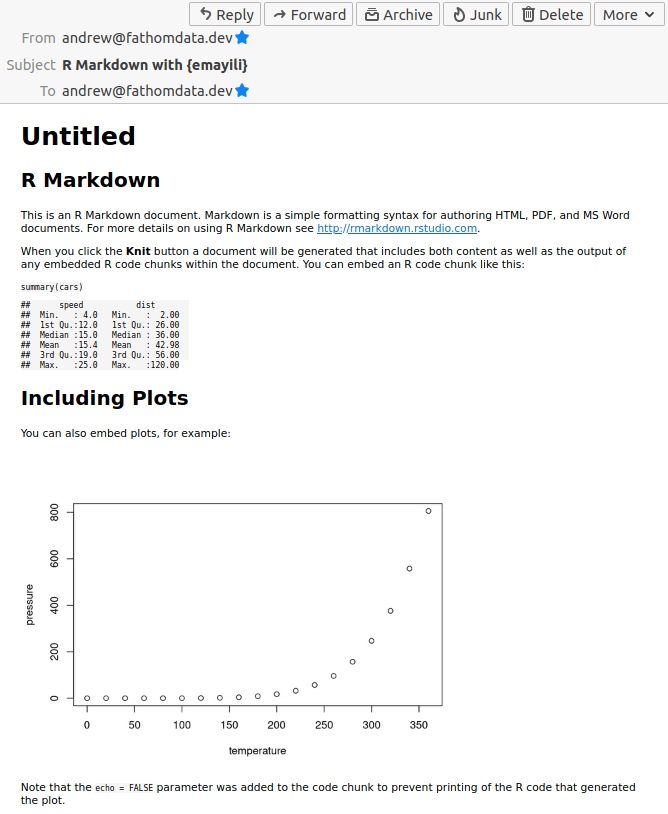

<!-- README.md is generated from README.Rmd. Please edit that file -->

# emayili 

<!-- badges: start -->

[](https://cran.r-project.org/package=emayili)

[](https://codecov.io/github/datawookie/emayili)
[](https://lifecycle.r-lib.org/articles/stages.html)
<!-- badges: end -->

emayili is a package for sending emails from R. The design goals are:

-   works on all manner of SMTP servers and
-   has minimal dependencies (or dependencies which are easily
    satisfied).

The package name is an adaption of the Zulu word for email, imeyili.

## Installation

Get the stable version from
[CRAN](https://CRAN.R-project.org/package=emayili).

``` r
install.packages("emayili")
```

Or grab it directly from
[GitHub](https://github.com/datawookie/emayili).

``` r
# Install from the master branch.
remotes::install_github("datawookie/emayili")
# Install from the development branch.
remotes::install_github("datawookie/emayili", ref = "dev")
```

## Usage

First create a message object.

``` r
library(emayili)
library(magrittr)

email <- envelope()
```

### Creating a Message

The message has class `envelope`.

``` r
class(email)
```

    [1] "envelope"

Add addresses for the sender and recipient.

``` r
email <- email %>%
  from("alice@yahoo.com") %>%
  to("bob@google.com") %>%
  cc("craig@google.com")
```

There are also `bcc()` and `reply()` functions for setting the `Bcc` and
`Reply-To` fields.

Add a subject.

``` r
email <- email %>% subject("This is a plain text message!")
```

Add a text body. You can use `html()` to add an HTML body.

``` r
email <- email %>% text("Hello!")
```

Add an attachment.

``` r
email <- email %>% attachment("image.jpg")
```

You can also create the message in a single command:

``` r
email <- envelope(
  to = "bob@google.com",
  from = "alice@yahoo.com",
  subject = "This is a plain text message!",
  text = "Hello!"
)
```

Simply printing a message displays the header information.

``` r
email
```

    Date:                      Fri, 10 Sep 2021 16:44:21 GMT
    From:                      alice@yahoo.com
    To:                        bob@google.com
    Cc:                        craig@google.com
    Subject:                   This is a plain text message!
    X-Mailer:                  {emayili}-0.4.19

You can identify emails which have been sent using `{emayili}` by the
presence of an `X-Mailer` header which includes both the package name
and version.

If you want to see the complete MIME object, just convert to a string.

You can also call the `print()` method and specify `details = TRUE`.

You can set the `envelope_details` option to assert that the details
should always be printed.

``` r
# Always print envelope details.
#
options(envelope_details = TRUE)
```

By default the results returned by most of the methods are invisible.
You can make them visible via the `envelope_invisible` (default:
`TRUE`).

``` r
# Always show envelope.
#
options(envelope_invisible = FALSE)
```

### Interpolating Text

You can use `{glue}` syntax to interpolate content into the body of a
message.

``` r
name = "Alice"

envelope() %>%
  text("Hello {name}!")
```

    Date:                      Fri, 10 Sep 2021 16:44:21 GMT
    X-Mailer:                  {emayili}-0.4.19
    MIME-Version:              1.0
    Content-Type:              text/plain; charset=utf-8
    Content-Disposition:       inline
    Content-Transfer-Encoding: 7bit

    Hello Alice!

### Rendering Markdown

You can render Markdown straight into a message.

Use either plain Markdown.

``` r
envelope() %>%
  # Render plain Markdown from a character vector.
  md("Check out `{emayili}` on [CRAN](https://cran.r-project.org/package=emayili).")
```

    Date:                      Fri, 10 Sep 2021 16:44:21 GMT
    X-Mailer:                  {emayili}-0.4.19
    MIME-Version:              1.0
    Content-Type:              text/html; charset=utf-8
    Content-Disposition:       inline
    Content-Transfer-Encoding: quoted-printable

    <p>Check out <code>{emayili}</code> on <a href="https://cran.r-project.org/package=emayili">CRAN</a>.</p>

Or R Markdown.

``` r
envelope() %>%
  # Render R Markdown from a file.
  rmd("message.Rmd")
```

In both cases the function will accept either a file path or a character
vector containing Markdown text.



🚨 **Note:** Inline images embedded in the rendered HTML will not appear
in the GMail (and potentially other) web client.

### Adding an Inline Image

Adding an inline image to an HTML message is possible. There are two
ways to achieve this.

*1. Base64 Encoding*

First you’ll need to [Base64
encode](https://en.wikipedia.org/wiki/Base64) the image.

``` r
img_base64 <- base64enc::base64encode("image.jpg")
```

Then create the HTML message body.

``` r
html_body <- sprintf('<html><body></body></html>', img_base64)
```

And finally add it to the email.

``` r
email <- envelope() %>% html(html_body)
```

*Note:* It’s important that you specify the appropriate media type
(`image/jpeg` for JPEG and `image/png` for PNG).

*2. Using a CID*

Unfortunately some mail clients (like Gmail) will not display Base64
encoded images. In this case using a CID is a working alternative.

First create the message body which references an image by CID.

``` r
html_body <- '<html><body></body></html>'
```

Then attach the image and specify the `cid` argument.

``` r
email <- envelope() %>%
  html(html_body) %>%
  attachment(path = "image.jpg", cid = "image")
```

### Sending a Message

Create a SMTP server object and send the message.

``` r
smtp <- server(host = "smtp.gmail.com",
               port = 465,
               username = "bob@gmail.com",
               password = "bd40ef6d4a9413de9c1318a65cbae5d7")
smtp(email, verbose = TRUE)
```

To see the guts of the message as passed to the SMTP server:

``` r
print(email, details = TRUE)
```

### Using STARTTLS

If you’re trying to send email with a host that uses the STARTTLS
security protocol (like Google Mail, Yahoo! or AOL), then it will most
probably be blocked due to insufficient security. In order to circumvent
this, you can grant access to less secure apps. See the links below for
specifics:

-   [Google](https://myaccount.google.com/security)
    ([details](https://support.google.com/accounts/answer/6010255))
-   [Yahoo!](https://login.yahoo.com/account/security) and
-   [AOL](https://login.aol.com/account/security).

## Standards Documents

The following (draft) standards documents relate to emails:

-   [RFC 2822](https://tools.ietf.org/html/rfc2822)
-   [RFC 5322](https://tools.ietf.org/html/rfc5322)
-   [RFC 6854](https://tools.ietf.org/html/rfc6854) (an update to RFC
    5322).

## Similar Packages

There is a selection of other R packages which also send emails:

-   [blastula](https://cran.r-project.org/package=blastula)
-   [blatr](https://cran.r-project.org/package=blatr) (Windows)
-   [gmailr](https://cran.r-project.org/package=gmailr)
-   [mail](https://cran.r-project.org/package=mail)
-   [mailR](https://cran.r-project.org/package=mailR)
-   [sendmailR](https://cran.r-project.org/package=sendmailR)
-   [ponyexpress](https://github.com/ropensci-archive/ponyexpress)
